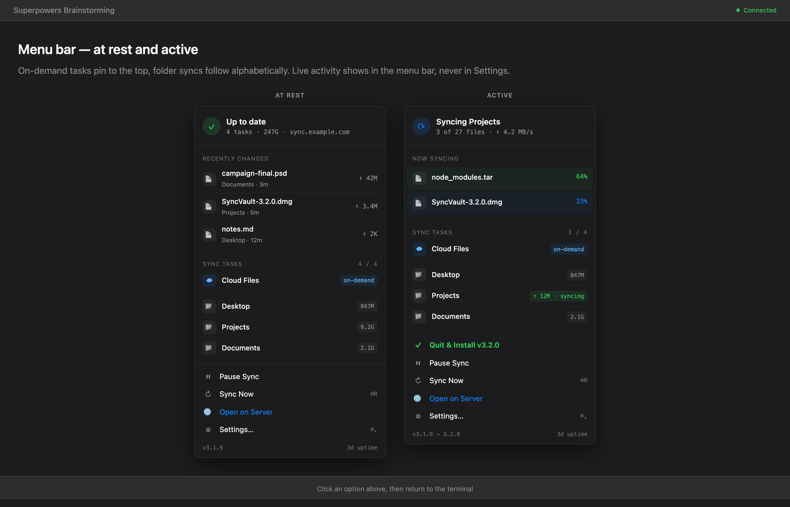
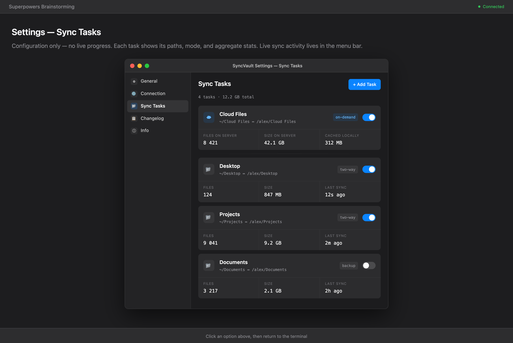
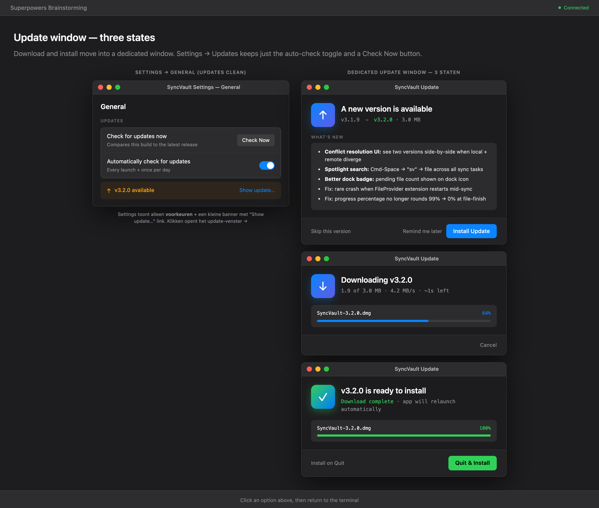
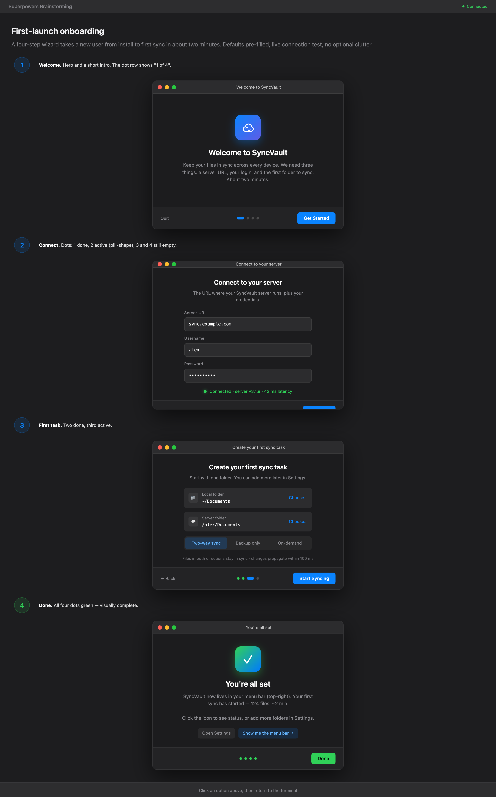
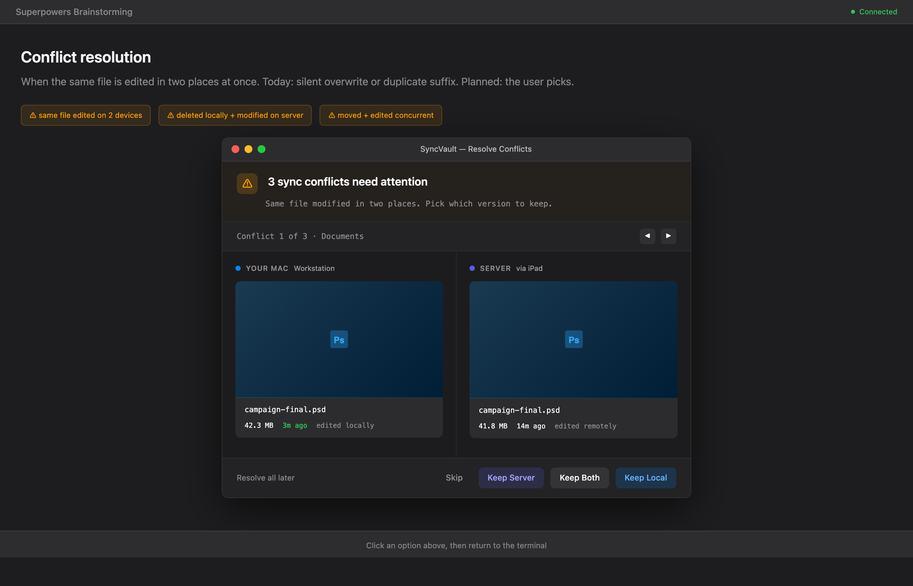
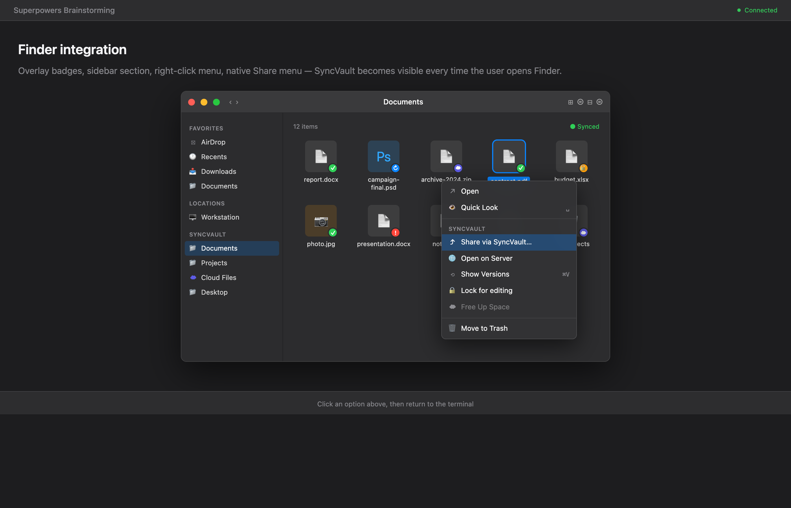

# SyncVault

Open-source file sync and backup platform. A self-hosted alternative to Synology Drive.

## Download

[](https://github.com/NielHeesakkers/SyncVault/releases/latest)

**macOS** — [Download SyncVault-3.6.2.dmg](https://github.com/NielHeesakkers/SyncVault/releases/download/v3.6.2/SyncVault-3.6.2.dmg) · [All releases](https://github.com/NielHeesakkers/SyncVault/releases) · [Changelog](internal/api/rest/changelog.txt)

Developer ID-signed and notarized by Apple. Requires macOS 13 or later. Auto-updates via Sparkle once installed.

## Inside the macOS app

A native menu bar app: redesigned UI, dedicated update window, guided first-launch wizard, conflict resolution, Finder integration, and rich notifications.

<table>
<tr>
<td width="50%"><b>Menu bar</b><br></td>
<td width="50%"><b>Settings — Sync Tasks</b><br></td>
</tr>
<tr>
<td><b>Dedicated update window</b><br></td>
<td><b>First-launch onboarding</b><br></td>
</tr>
<tr>
<td><b>Conflict resolution</b><br></td>
<td><b>Finder integration</b><br></td>
</tr>
</table>

[Full design walkthrough →](docs/design/mockups/README.md) · [Design spec →](docs/superpowers/specs/2026-05-24-v3.2.0-design.md)

## Features

- **Real-time Push Sync** — Server pushes file events to clients via SSE; changes propagate in under 100 ms without polling (Synology Drive-style)
- **File Sync** — Two-way sync between your devices and the server
- **Backup** — One-way backup with real-time file change detection (FSEvents)
- **On-Demand Sync** — Files appear in Finder via FileProvider, download only when opened. Classic Mac resource forks (old fonts etc.) are preserved via AppleDouble packing
- **Delta Sync** — Only changed bytes are uploaded (rsync-style block comparison)
- **Per-folder Cache** — Tree listings return in microseconds; only the touched subtree invalidates on a mutation
- **File Versioning** — Up to 32 versions per file with retention policies
- **Restore Files Browser** — Synology-style point-in-time browser: pick a folder, scrub a timeline of restore points, download or restore the snapshot
- **Trash & Recovery** — In-app trash window with one-click Restore, Permanent Delete and Empty Trash
- **Conflict Resolution** — Detects sync conflicts and resolves them side-by-side in the app
- **File Preview** — Inline preview for images, video, audio, PDF, and code with syntax highlighting
- **Team Folders** — Shared folders with per-user read/write permissions
- **Share Links** — Password-protected download links with expiration and download limits
- **Web Interface** — File browser with sortable columns, dark/light mode, storage breakdown charts
- **macOS App** — Native menu bar app with per-byte progress, delta sync, streaming upload
- **User Profiles** — Avatar upload, display name, storage usage
- **Email Notifications** — SMTP notifications for shares and password resets
- **Storage Insights** — Donut chart by file type, per-user and per-folder breakdown
- **Activity Log** — Track who did what, filterable by user, action, and date
- **Retention Policies** — Automatic cleanup with daily/weekly/monthly/yearly tiers
- **Docker Deployment** — Single container, easy to run anywhere
- **Prometheus Metrics** — `/api/metrics` endpoint for monitoring

## Architecture

| Component | Technology |
|-----------|-----------|
| Server | Go (REST API, Chi router) |
| Web UI | SvelteKit + Tailwind CSS |
| macOS App | Swift + SwiftUI |
| Database | SQLite (WAL mode, 8 connections, 256MB mmap) |
| File Storage | Content-addressable with deduplication and reference counting |
| Auth | JWT + bcrypt + rate limiting |
| Sync Protocol | Streaming PUT upload + rsync-style delta sync |

## Sync Engine

### Upload Protocol

Files are uploaded via a simple `PUT /api/files/put` endpoint with raw bytes — no multipart, no temp files. The macOS app streams directly from disk using `URLSession.uploadTask(fromFile:)` with a delegate for per-byte progress reporting.

| File Size | Method | Speed |
|-----------|--------|-------|
| Any size | Raw PUT streaming from disk | 35-40 MB/s on LAN |
| 1-500 MB (modified) | Delta sync (only changed blocks) | 95-100% bandwidth saved |

### Change Detection

Like Synology Drive, SyncVault uses **mtime + file size** for change detection — no SHA-256 hashing needed on the client. FSEvents provides real-time file monitoring with a 4-hour fallback scan.

### Delta Sync

When a file that already exists on the server is modified:

1. Client fetches 256KB block signatures from server (Adler-32 + SHA-256)
2. Client scans local file for matching blocks using rolling hash
3. Only changed blocks are uploaded via `POST /api/files/{id}/delta`
4. Server reconstructs the file from reused + new blocks
5. If >70% changed, falls back to full upload

### Server Storage

Files are stored as single files on disk (no chunking for new uploads). The server writes at full network speed first, then computes SHA-256 hash after — decoupling network I/O from CPU work. Block reference counting prevents data loss when files sharing blocks are deleted.

### Real-time Push (SSE)

Every mutation publishes a `FileEvent` (id, owner, hash, rank) to subscribers of `/api/events`. Clients keep one long-lived connection open (HTTP/2, keep-alive) and:

1. On connect: get a `connected` event, then any events missed since `device_id`'s last cursor (per-device replay).
2. On every server-side mutation: a `file` event is pushed within milliseconds.
3. Keep-alive comment every 30 s prevents middleboxes from closing the connection.

Result: a file saved on Mac A appears on Mac B in under 100 ms, no polling, no full tree refetch.

### Tree Cache & ETag

`GET /api/files/tree` is the hot path. Two layers keep it cheap:

- **Per-folder in-memory cache**, validated by each folder's own `change_rank`. An upload in `/Werkmap` only invalidates the cache for that subtree and its ancestors — unrelated folders like `/Development` stay warm.
- **ETag / If-None-Match (304)** on every tree response, derived from the same per-folder rank. The client skips parsing entirely when nothing changed.

The recursive CTE under the cache uses `INDEXED BY idx_files_parent_deleted` to force the right query plan — without it SQLite picks the deleted_at index and degrades from 0.4 s to 273 s on a 9 K-file subtree.

### Performance

| Metric | Value |
|--------|-------|
| Upload speed (LAN) | 35-40 MB/s |
| Upload speed (old block protocol) | 69 KB/s |
| Improvement | 550x |
| Scan (43K files with node_modules) | Skipped → 622 files |
| Hash computations (mtime cache hit) | 0 |
| Delta sync (small edit on 685MB file) | 0 bytes transferred |

## Security

- Path traversal protection (filepath.Abs + prefix validation)
- CORS restricted to same-origin (+ `SYNCVAULT_CORS_ORIGIN` env var)
- Rate limiting: 10/min on auth endpoints, 60/min on uploads
- Share links require file ownership verification
- Admin settings API key whitelist
- Filename validation (max 255 chars, no path separators)
- Security headers (X-Content-Type-Options, X-Frame-Options, Referrer-Policy)
- Block reference counting (prevents data loss on shared block deletion)
- Download hash verification (SHA-256 after download)
- Integrity check (24-hour automatic comparison of local vs server file counts)

## Quick Start

### Docker Compose

```yaml
version: "3.8"

services:
  syncvault:
    image: ghcr.io/nielheesakkers/syncvault:latest
    container_name: syncvault
    ports:
      - "8080:8080"
    volumes:
      - syncvault-data:/data
    environment:
      - SYNCVAULT_JWT_SECRET=change-this-to-a-long-random-string
    healthcheck:
      # Fails when storage is unreachable (e.g. a stale mount) OR the server is
      # down — not just on a non-200, so an orchestrator restarts the container
      # to re-establish storage instead of leaving it silently degraded.
      test: ["CMD-SHELL", "wget -qO- http://localhost:8080/api/health | grep -q '\"storage_ok\":true'"]
      interval: 30s
      timeout: 5s
      retries: 3
      start_period: 15s
    restart: unless-stopped

volumes:
  syncvault-data:
```

### Run with Docker

```bash
docker run -d \
  -p 8080:8080 \
  -v syncvault-data:/data \
  -e SYNCVAULT_JWT_SECRET=your-secret-here \
  ghcr.io/nielheesakkers/syncvault:latest
```

### Build from Source

```bash
git clone https://github.com/NielHeesakkers/SyncVault.git
cd SyncVault

# Build and run
make run

# Or with Docker
docker compose up --build
```

## Default Login

After first start, a default admin account is created:

- **Username:** `admin`
- **Password:** `admin`

**Change this immediately** after first login.

## Configuration

All configuration is via environment variables:

| Variable | Default | Description |
|----------|---------|-------------|
| `SYNCVAULT_DATA_DIR` | `/data` | Data directory for files and database |
| `SYNCVAULT_HTTP_PORT` | `8080` | HTTP port for REST API and Web UI |
| `SYNCVAULT_JWT_SECRET` | (random) | Secret key for JWT tokens |
| `SYNCVAULT_STORAGE_TOTAL_GB` | (auto) | Override total disk capacity |
| `SYNCVAULT_CORS_ORIGIN` | (same-host) | Allowed CORS origin for reverse proxy |
| `SYNCVAULT_LOG_FORMAT` | text | Set to `json` for structured JSON logging |
| `SYNCVAULT_TLS_CERT` | | Path to TLS certificate (optional) |
| `SYNCVAULT_TLS_KEY` | | Path to TLS private key (optional) |

## Storage

```
/data/
├── syncvault.db     # SQLite database
├── files/           # Content-addressable file storage
│   └── ab/cd/       # Sharded by hash prefix
└── incoming/        # Temporary upload staging
```

## Reverse Proxy (Nginx Proxy Manager)

Add to **Advanced** > **Custom Nginx Configuration**:

Main proxy block:

```nginx
client_max_body_size 0;
proxy_read_timeout 86400;
proxy_send_timeout 86400;
proxy_connect_timeout 86400;
proxy_request_buffering off;
proxy_http_version 1.1;
```

Then add a per-location override for `/api/events` so SSE bytes flush immediately:

```nginx
location /api/events {
    proxy_buffering off;
    proxy_cache off;
    proxy_set_header Connection "";
    # ...same proxy_pass as the main block
}
```

> **Nginx Proxy Manager users:** enable `Websockets Support` on the host (which already injects `proxy_http_version 1.1` — do NOT duplicate it in the custom location, nginx refuses to start). Then add a Custom Location for `/api/events` with `proxy_buffering off; proxy_cache off; proxy_set_header Connection "";`.

## API

### Authentication
- `POST /api/auth/login` — Login
- `POST /api/auth/refresh` — Refresh token

### Files
- `GET /api/files?parent_id=` — List files (one level)
- `GET /api/files/tree?folder_id=` — Recursive tree listing (ETag/304-aware, per-folder cache)
- `PUT /api/files/put?parent_id=&filename=` — Upload file (raw bytes)
- `GET /api/files/{id}/download` — Download
- `GET /api/files/{id}/blocks` — Block signatures for delta sync
- `POST /api/files/{id}/delta` — Delta upload (changed blocks only)

### Real-time push
- `GET /api/events?device_id=` — SSE stream of file events (server push, per-device replay cursor)

### Versions
- `GET /api/files/{id}/versions` — List versions
- `POST /api/files/{id}/versions/{num}/restore` — Restore version

### Sharing
- `POST /api/files/{id}/shares` — Create share link
- `GET /s/{token}` — Public share page

### Monitoring
- `GET /api/health` — Health check
- `GET /api/metrics` — Prometheus-compatible metrics

## macOS App

Native menu bar app with:

- Real-time file sync via FSEvents
- Per-byte upload progress bar
- Delta sync for modified files
- Streaming upload (no temp files, no memory pressure)
- Unified sync task overview (backup + on-demand)
- Recently changed files with task attribution
- Restore Files window — point-in-time browser with per-folder timeline and streaming download
- Trash window — restore or permanently delete from inside the app
- On-demand resource-fork preservation (classic Mac fonts via AppleDouble)
- Auto-skip of dev directories (node_modules, DerivedData, build, etc.)
- 24-hour integrity check
- Sparkle auto-update

Build release:

```bash
cd macos
./build-release.sh
```

## License

MIT
