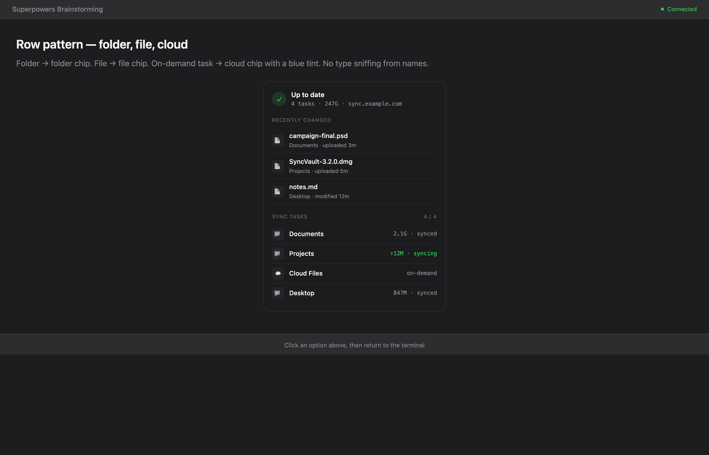
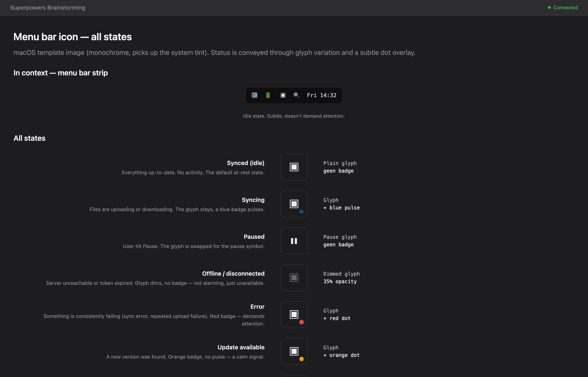
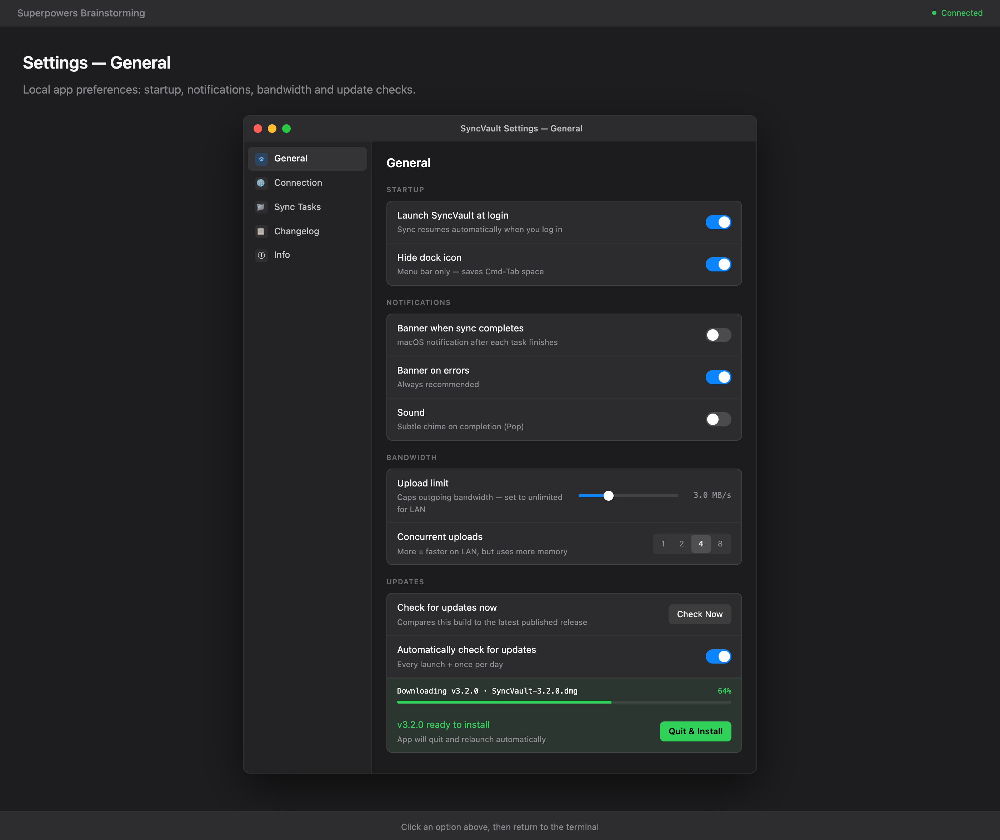
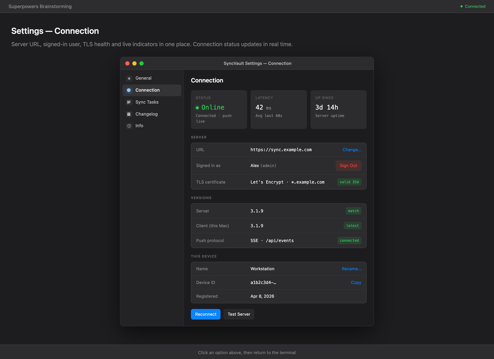
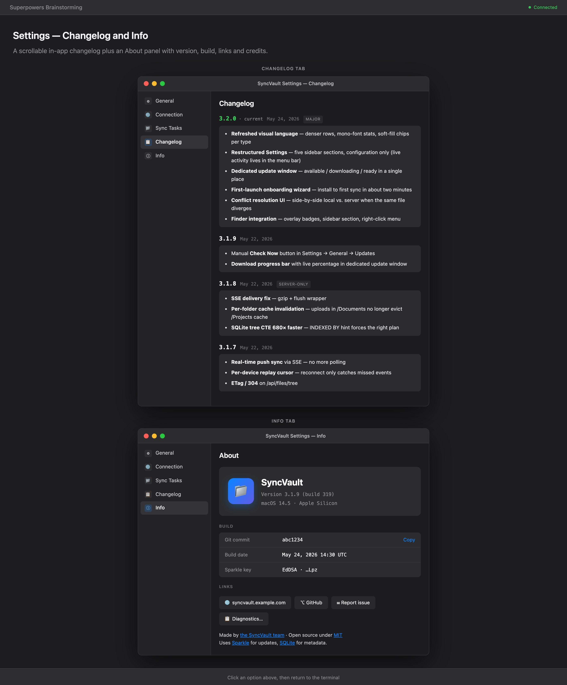
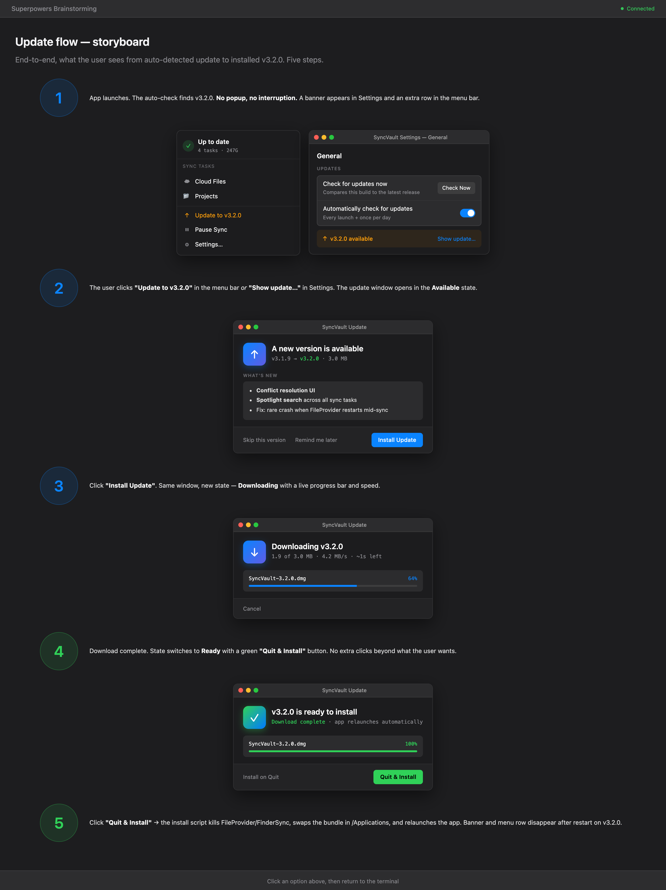

# SyncVault 3.2.0 — Design

The next major release refreshes the menu bar app's visual language, restructures
the settings window, replaces the in-app update flow with a dedicated window,
adds a guided first-launch wizard, and lays out the next round of features
(conflict resolution and deeper Finder integration).

## Visual language

The whole app moves to a denser, utilitarian look — Linear/Notion-inspired
mono-font for stats, soft-fill chips per file type, and a consistent row pattern
that scales from menu bar to settings.

Folder → folder chip. File → file chip. On-demand task → cloud chip with a
blue tint. No type sniffing from names — the chip reflects what the row
represents, not what software it was made with.

## Menu bar

The popover keeps a clean three-block layout: a header with sync state, a
Recently changed feed, and the configured sync tasks. On-demand tasks pin
above folder syncs, separated by a hairline divider. All live activity —
progress bars, current file, throughput — lives here. Settings stays
configuration-only.

The status icon in the menu bar itself has seven well-defined states, all built
from the same base glyph with at most one badge overlay. The glyph stays
constant across four of seven states so users recognise the app first,
status second.

## Settings

The settings window uses a sidebar with five sections. All live activity
(progress bars, current upload, "syncing" labels) lives in the menu bar —
settings is purely configuration.

### General

Local app preferences grouped by intent: Startup, Notifications, Bandwidth,
and Updates. Each toggle carries a one-line subtitle so users never have to
guess what it does. The Updates section keeps only the auto-check toggle
and a Check Now button; the actual update flow opens in its own window.

### Connection

Three live health cards across the top (status, latency, server uptime),
then server URL, signed-in user with sign-out, TLS certificate validity,
version match between client and server, and this device's name and ID.
Reconnect and Test Server actions live at the bottom for quick recovery.

### Sync Tasks

Configuration only — no status pills, no progress strips. Each task card
shows its name, paths, mode chip, enabled toggle, and aggregate stats
(files, size, last sync timestamp). On-demand tasks pin above the
divider; folder syncs follow alphabetically.

### Changelog + Info

A scrollable in-app changelog with versioned cards (current version
highlighted in green, tagged "major" or "server-only" where relevant),
plus an About panel with app hero, version, build metadata, and links
to the website, GitHub, issue tracker and diagnostics export.

## Update flow

The in-app updater moves out of settings into its own window. Three states
in one place: available → downloading → ready to install. Settings keeps
only the auto-check toggle and a "Check Now" button.

End-to-end, the user sees this flow:

Auto-check finds a new version → a passive banner appears in Settings
and an extra row in the menu bar. Clicking either opens the update
window. Install, watch the progress bar, then a green Quit & Install
button takes the user the last mile.

## First-launch onboarding

A four-step wizard takes a new user from install to first sync in about
two minutes: welcome, server connection (with live test), first sync task,
and confirmation. Defaults are pre-filled, dots at the bottom show
progress, and the success step nudges the user toward the menu bar
where the app now lives.

## Planned for 3.2.x

### Conflict resolution

Today, simultaneous edits on two devices result in a silent overwrite or
a duplicated file with a suffix. The new dedicated conflict window pairs
the local and server versions side by side with thumbnails, mtime and
size, then lets the user pick Keep Local, Keep Server, or Keep Both.
Multiple conflicts are walked one at a time with arrow navigation.

### Finder integration

A Finder extension surfaces SyncVault everywhere the user already looks
at files: overlay badges on each icon (synced, syncing, on-demand,
locked, error), a dedicated SyncVault section in the Finder sidebar,
and a right-click submenu with Share, Open on Server, Show Versions,
Lock for editing, and Free Up Space.

